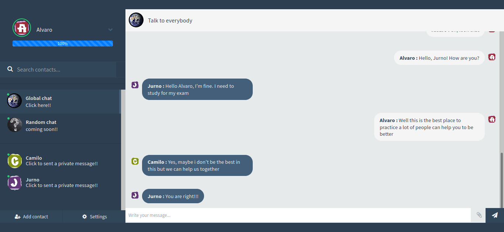

# Nice to meet you
Chat principalmente en javascript para frontend, backend and database. Pensado para permitir que las personas que desean practicar su ingles y conocer otras personas con gustos afines y con el deseo de aprender este idioma tan indispensable para nuestro campo.

# Susurros en el chat global
Es importante mantener un sistema que permita comunicar mensajes cortos con las personas mas.

# ¿Como instalarlo?
Es tan simple como clonar o descargar el proyecto y ejecutar:

- npm install
- npm run start 

# ¿Que tecnologias se emplearon?
- Html
- Css
- javascript
- Nodejs
  - Express
  - Socket.io
- Mongodb

# Links de recursos adicionales
- [Bootstrap4 CDN](http://getbootstrap.com/docs/4.0/getting-started/introduction/)
- [jQuery CDN](https://code.jquery.com/)
